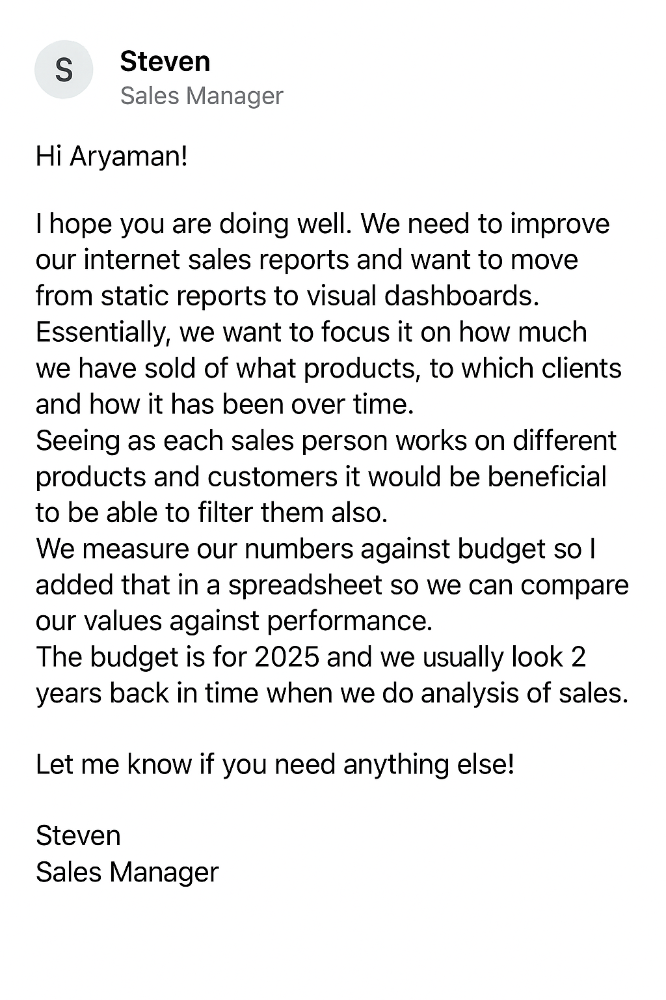
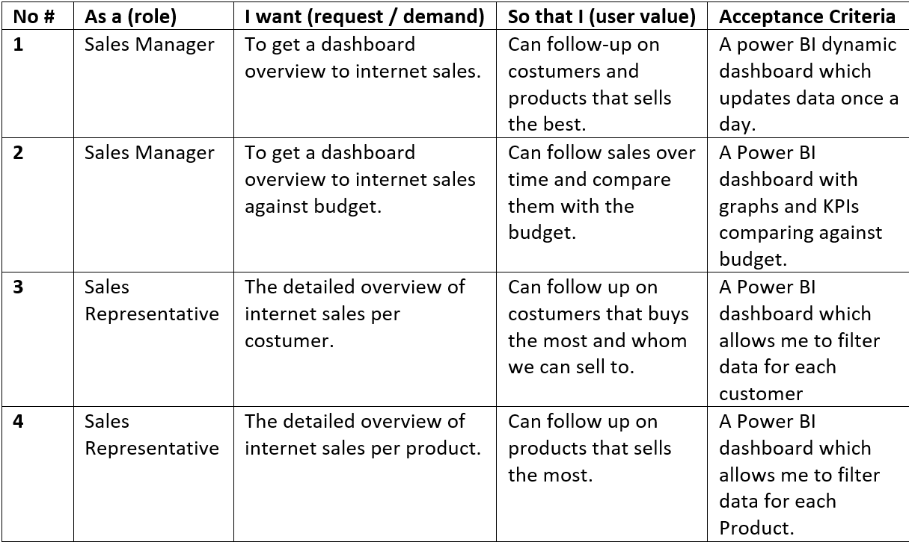
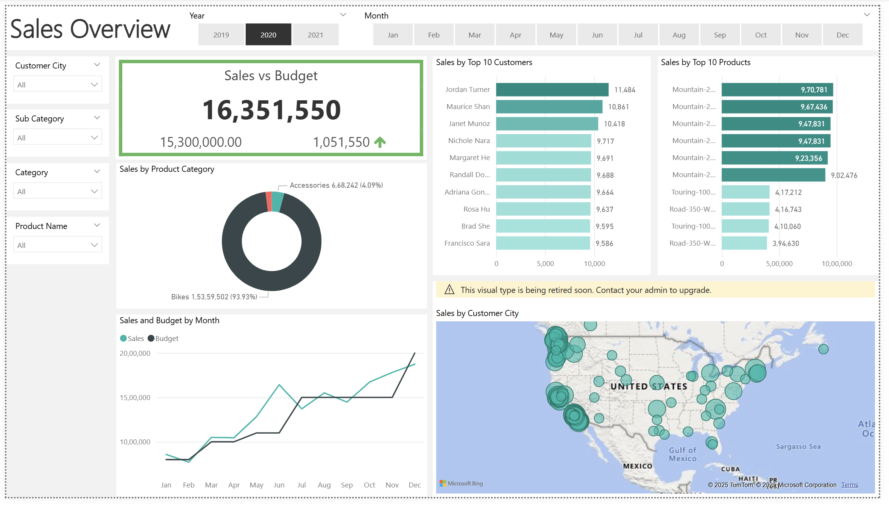
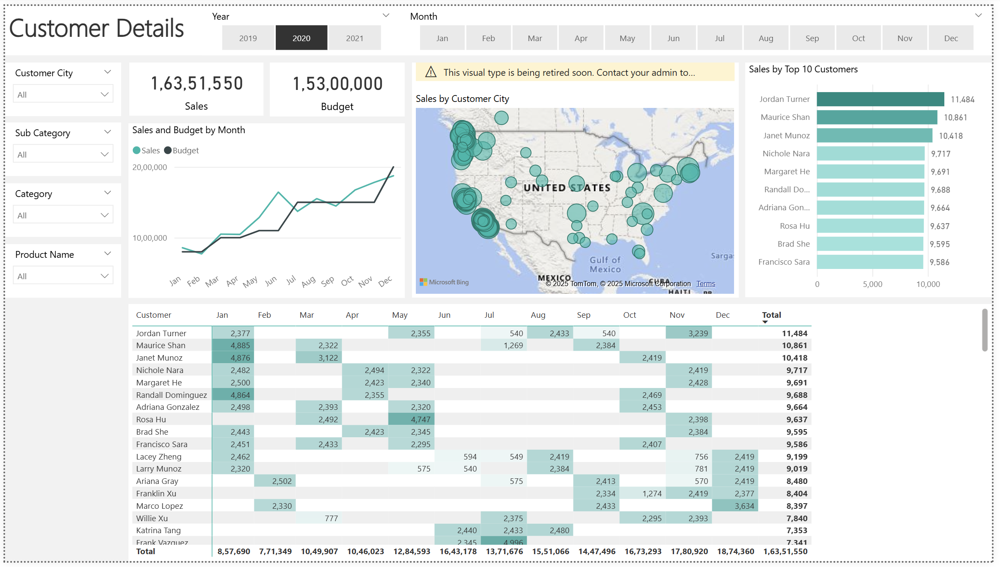
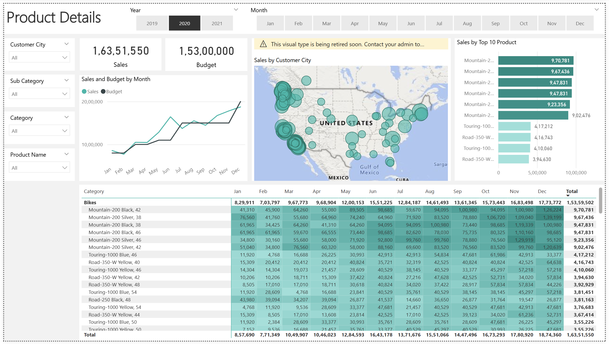
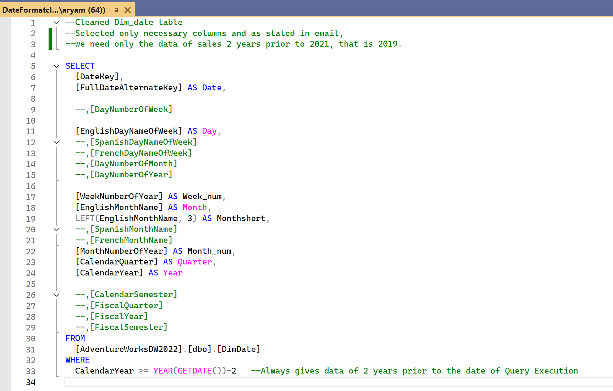
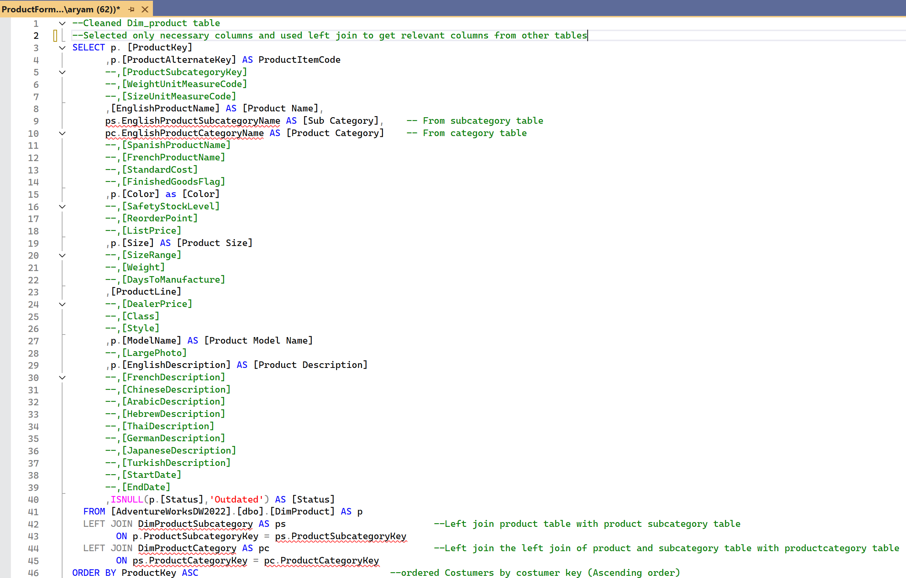
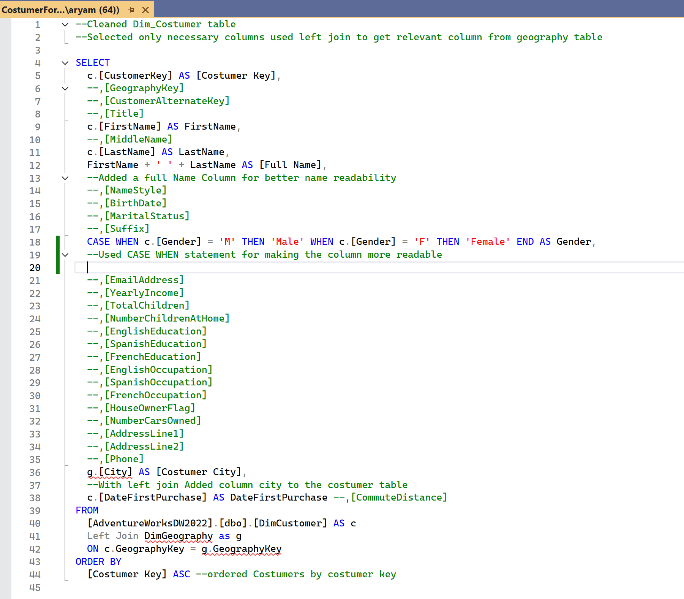
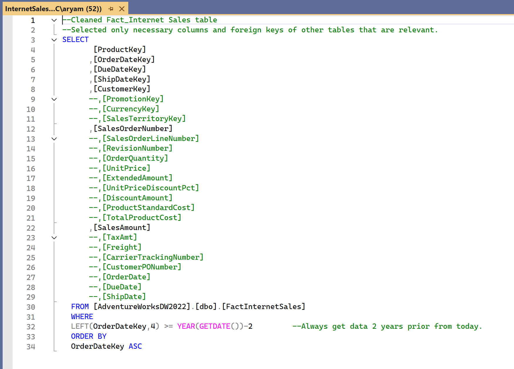

# Sales-Analysis-Using-SQL-PowerBI for B2C company
This project transforms static internet sales reports into interactive Power BI dashboards, delivering insights on sales performance, customer behavior, and product trends. Using SQL Server and the AdventureWorksDW dataset, two years of historical data were dynamically cleaned and modeled with fact and dimension tables. The dashboards also integrate the 2025 budget, enabling actionable, data-driven decision-making.
## 🧾Executive Summary

The Sales Manager requested to move from static internet sales reports to interactive dashboards for better insights into sales, customers, and products.
#### 🔑Key Contributions:

1. **Gathered requirements** and wrote **user stories**.
2. Cleaned and prepared data with **SQL Server 2021**.
3. Exported processed data to CSV for **Power BI**.
4. Transformed and modeled data using Power Query.
5. Built **dynamic dashboards** for Sales, Customers, and Products with budget comparison.

#### #️⃣Next Steps: 
To get data by **Composite Mode**: Try to connect the fact tables using direct Query or Live Connection to always get the latest data and using import for dimension tables like Calendar for optimizing dashboard and to run **Time Intelligence** functions without errors

## 📄Business Demand

The Sales Manager requested a shift from static internet sales reports to interactive visual dashboards that allow tracking of sales by product, customer, and over time. The dashboards should include **filtering options** for salespersons, products, and customers, provide **comparison**s of actual sales against the 2025 budget, and incorporate two years of **historical data** for analysis.
<table align="center">
  <tr>
    <td align="center"></td>
    <td align="center"></td>
  </tr>
</table>

## 🧑‍🏭Methodology

This project applied a structured data analytics approach using SQL Server 2021 for cleaning and **dynamically querying** two years of sales data. Processed results were exported to CSV and transformed in Power BI’s Power Query for modeling and integration with the 2025 Budget Excel file. A **star schema** enabled dynamic dashboards for sales, customer, and product insights.

### 💾Dataset Used-

&nbsp;  [AdventureWorksDW](https://github.com/Microsoft/sql-server-samples/releases/download/adventureworks/AdventureWorksDW2022.bak) (Data Warehouse(DW) data is for data warehousing workloads.)
###### Cannot upload dataset as it is above the limit of 25 MB.

### 🧰Tools Used-
**Microsoft SQL Server 2021** – Data cleaning, dynamic querying (AS, LEFT JOIN, CASE WHEN, ISNULL, GETDATA, column concatenation, comments)
**Power BI** – Data transformation, modeling, dashboard creation (MEASURES, CALCULATED COLUMNS, Multiple Dashboards)
**Excel** – Budget 2025 dataset cleaning (Table creation)

###### 📂 For further details, including raw queries, transformed dataset csv files, and the Power BI file, please check the files available in the project repository.

## 📜Result

The project delivered a fully interactive Power BI report containing three dashboards: **Sales Overview, Customer Details, and Product Details**. The Sales Overview highlighted **performance trends, KPIs, and comparisons** against the 2025 budget. The Customer Overview enabled **filtering by individual customers to identify top buyers and growth opportunities**. The Product Overview displayed **product-level sales patterns** to track best-sellers and underperformers. Together, these dashboards provided actionable insights for the sales team, replacing static reports with dynamic, data-driven decision-making tools.

#### 📊 Screenshots of the dashboards and queries are inserted here for illustration.
##### *Dashboard:*

##### *Queries:*
<table align="center">
  <tr>
    <td align="center"></td>
    <td align="center"></td>
  </tr>
  <tr>
    <td align="center"></td>
    <td align="center"></td>
  </tr>
</table>

[Click here to get to the query files](./SQL_Queries/)

###### 📂 All related queries, CSV files, and the Power BI file can be found in the project repository.
